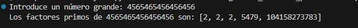
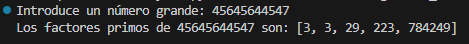

# Factores Primos de Números Grandes

Este repositorio contiene un script en Python que encuentra los factores primos de un número grande introducido por el usuario. El programa es eficiente y utiliza una estrategia basada en la divisibilidad de números primos, que se explica en detalle a continuación.

## Descripción

El objetivo de este proyecto es ofrecer una solución sencilla y eficiente para encontrar los factores primos de números grandes. El usuario introduce un número entero y el programa devuelve todos los factores primos de ese número.

### ¿Qué son los factores primos?

Un factor primo es un número primo que divide a otro número exactamente, sin dejar residuo. La descomposición de un número en sus factores primos es una operación común en muchas aplicaciones matemáticas y criptográficas.

### Algoritmo

El algoritmo para encontrar los factores primos sigue los siguientes pasos:

1. **Eliminación de factores de 2**: Si el número es divisible por 2, el algoritmo lo divide repetidamente hasta que ya no sea divisible por 2.
2. **Revisión de números impares**: Luego, se revisan los números impares desde 3 en adelante hasta la raíz cuadrada del número, probando si son divisores.
3. **Comprobación final de primos grandes**: Si después de todos los intentos el número sigue siendo mayor que 2, significa que es un número primo y se agrega a la lista de factores.

## Uso

### Requisitos

- Python 3.x
- Librería estándar de Python (`math`)

### Ejecución

Para ejecutar el script, simplemente clona este repositorio y ejecuta el archivo Python desde tu terminal o IDE favorito.

## Demostración




1. Clona el repositorio:

   ```bash
   git clone https://github.com/usuario/factores-primos.git

## Contacto

Para cualquier consulta o sugerencia, puedes contactar al desarrollador:

- **Nombre**: Adrian Martinez Martinez
- **Correo**: martinezmartinezaadrian@gmail.com
- **GitHub**: [ByTRAX78](https://github.com/ByTRAX78)